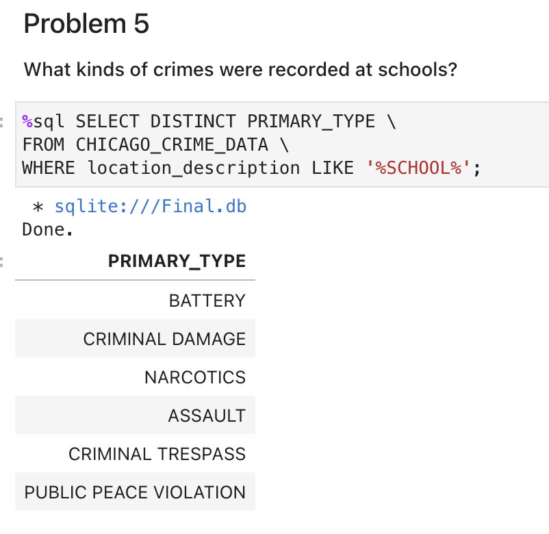
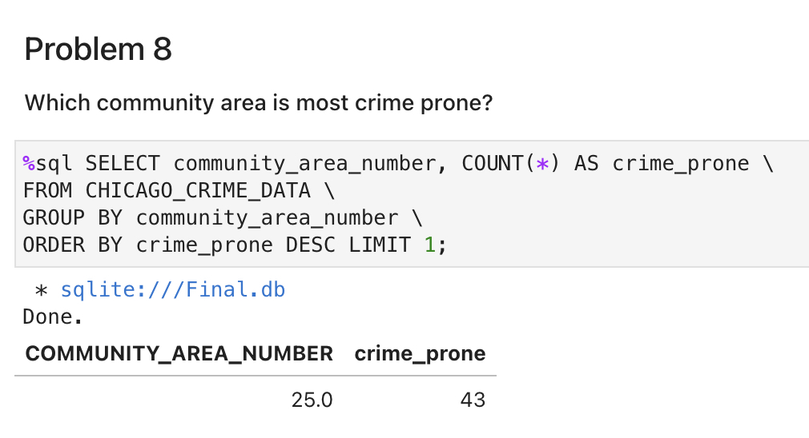
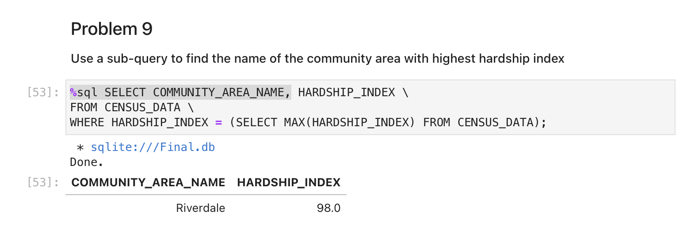
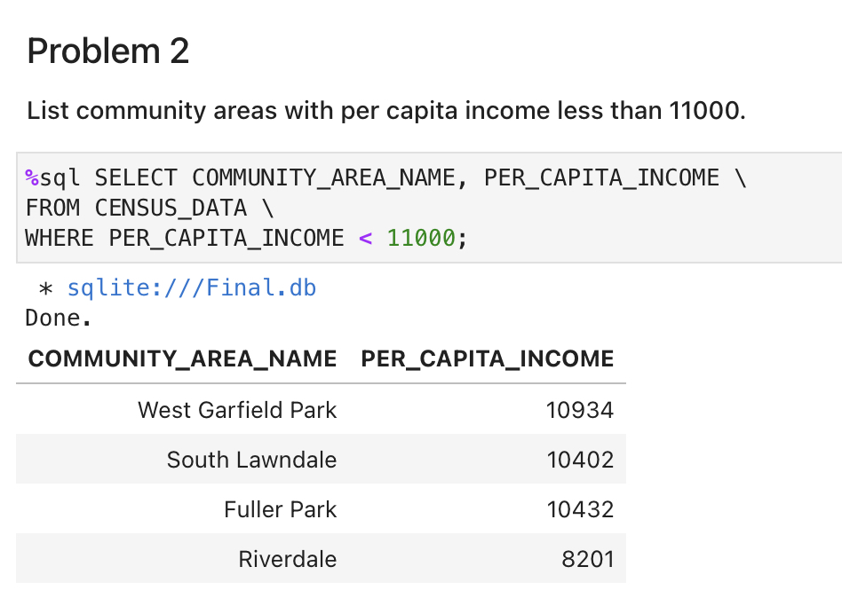
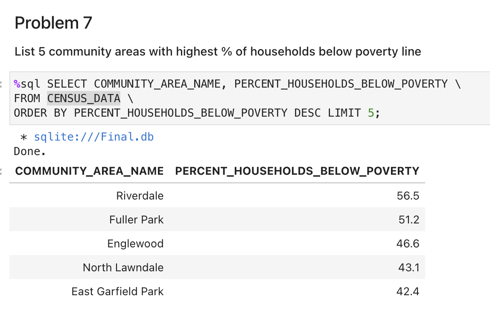

# Chicago Socioeconomic Crime Data Analysis

## Project Overview
This project analyzes the relationship between socioeconomic factors and crime in Chicago using SQL and Python.

The goal was to identify patterns between income levels, poverty, hardship index, and crime distribution across different community areas.

---

## Tools & Technologies
- SQL (data extraction, filtering, aggregation)
- Python (data analysis)
- Pandas
- Data visualization

---

## Key Insights
- Higher poverty areas tend to have higher crime rates
- Certain community areas show consistently higher hardship index
- Crime types vary depending on location (e.g., schools vs residential areas)

---

## Analysis Results

### Crimes at Schools


---

### Most Crime-Prone Areas


---

### Highest Hardship Index


---

### Poverty vs Income


---

### Top Poverty Areas


---

## SQL Example
```sql
SELECT DISTINCT PRIMARY_TYPE
FROM CHICAGO_CRIME_DATA
WHERE location_description LIKE '%SCHOOL%';
